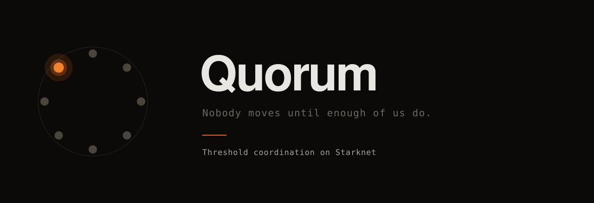

<div align="center">



<br>

**[Live app](https://quorum-alpha-drab.vercel.app)** &nbsp;·&nbsp;
**[Rubric map](RUBRIC_MAP.md)** &nbsp;·&nbsp;
**[Contract on mainnet](https://voyager.online/contract/0x0079bab03056fd05dde50e921cf5ea8c3405aaaa2f05492a8a0e1fb6c811ff76)** &nbsp;·&nbsp;
**[The adversarial tests](contracts/tests/quorum_test.cairo)** &nbsp;·&nbsp;
**[How it works](https://quorum-alpha-drab.vercel.app/how)**

<br>


</div>

<br>

> **Pledge into a campaign and your pledge binds only once enough others have pledged too.**
> If the quorum is never reached, you get your money back and you were never revealed.

<br>

## The problem

There is a class of action nobody can take alone.

You cannot unionise publicly — you are fired. You cannot report a serial harasser alone — you are destroyed and they are not. You cannot commit to a boycott alone — it fails, and you are marked as the one who tried. You cannot be the first name on a class action.

In every case the obstacle is identical, and it is not secrecy for its own sake:

> **The first mover carries all the risk and receives none of the benefit.**

So nobody moves, and an action a majority privately wants never happens. Economists call this a collective action problem. Everyone else calls it Tuesday.

A threshold inverts the payoff. If your commitment binds only once enough others have committed, going first costs nothing. The mechanism is decades old — Ayres and Nalebuff described **information escrows** for exactly this, and Callisto built one for campus assault reports that opens only when a second report names the same person.

What has never existed is a way to run it where the escrow holds **real money**, the count is enforced by **something other than trust**, and **nobody is exposed when it fails**.

<br>

## Why this needs a shielded pool

|  | What breaks |
|---|---|
| **On a public chain** | Every pledge is public. The employer reads the list before it is long enough to protect anyone. The mechanism defeats itself. |
| **On a server** | The operator is a single point of coercion. A subpoena, a court order, a bribe, or one disgruntled engineer unmasks everyone at once. |
| **On the STRK20 pool** | A pledge is an encrypted note. Value moves without naming who moved it, escrow is held by a contract rather than a company, and settlement is atomic. |

> The privacy is not a feature bolted onto a coordination app.
> **Remove it and there is no product, because there is no coordination.**

<br>

## The organiser is not a superuser

The first version of this contract had a hole big enough to void the whole idea, and it is worth stating plainly because it is the hole every version of this mechanism has had.

Whoever held the fire secret chose the payout destinations **at fire time**. Conservation checked that the sums matched; nothing checked where the money went. That is not an information escrow — it is a private pot with a threshold and a keyholder, and it fails for exactly the reason Callisto fails if the campus admin can redirect the reports.

So the organiser was removed, not constrained:

| | |
|---|---|
| **Destinations are fixed at creation** | `BoundTreasury` campaigns commit a `payout_root` before a single pledge arrives. Fire must reproduce that set exactly, in order, or the fold differs and it reverts. |
| **`RefundAll` cannot move value at all** | The pure escrow. Every pledge returns to its pledger; the only consequence of quorum is that the set opens to the people inside it. There is no payout path to abuse. |
| **Firing is permissionless** | No fire secret exists. Anyone may fire once quorum is met and the window is open — so there is no key to lose, none to steal, and nobody who can sit on a signed list as leverage. |

There is no privileged party left. An organiser can start a campaign, and that is the whole of their power.

## Sybil, and why every pledge is the same size

A count threshold with free pledges is not a threshold — one person with forty secrets is forty pledges.

The pool will not tell a helper contract who is calling; that is precisely what it is for. So identity cannot be bound here. What can be bound is **price**: every pledge in a campaign must be exactly `unit`. Forty fake pledges cost forty units, and the attack becomes bounded by money rather than by imagination.

It buys a second thing. Every pledge being identical means the public transfer carries no information — an observer sees `unit`, which the campaign already published. Variable pledges would have leaked seniority, salary and conviction, one transfer at a time.

## Value is measured, never taken on trust

The pool moves tokens to a helper and *then* calls it, so a helper that believes the amount in its own calldata is trusting a number it was handed. Under-report and the surplus is stranded forever; over-report and the campaign can never fire, because its escrow will never match its balance.

Every operation measures the ERC-20 balance and works from the delta. `held(token)` is a public view, so stranded value is visible rather than invisible.

## What the contract enforces

| Invariant | Meaning |
|---|---|
| **Bound destinations** | Fire cannot pay anywhere the campaign did not commit to before the first pledge. |
| **Threshold enforcement** | A campaign cannot fire below quorum. The transaction reverts. |
| **No late fire** | Once expired, refunds are the only remaining path. |
| **Measured value** | Pledges are the balance delta, and must equal the published unit exactly. |
| **Value conservation** | Payouts sum to exactly what was escrowed, in the token escrowed. |
| **Pledge-set immutability** | Pledges fold into an order-dependent root, fixing the set as a sequence. |
| **Single-use reclaim** | A refund needs that pledge's own preimage, and burns it. |
| **No early disclosure** | `Unseal` reverts below quorum — the chain refuses a disclosure even from someone who has decided to make one. |

## The tests are the product

A coordination mechanism is worth nothing unless it holds when the person running the campaign turns on the people in it. The adversarial cases *are* the suite; the happy path is almost incidental.

```
a_firer_cannot_redirect_payouts_to_themselves               PASS
a_firer_cannot_skim_a_slice_to_themselves                   PASS
payout_order_is_part_of_the_commitment                      PASS
a_refund_all_campaign_cannot_move_value_at_all              PASS
fire_is_permissionless_once_quorum_is_met                   PASS
nobody_can_fire_below_quorum                                PASS
a_met_quorum_still_cannot_fire_late                         PASS
commit_uses_the_balance_delta_not_the_calldata              PASS
a_pledge_below_the_unit_reverts                             PASS
a_pledge_above_the_unit_reverts                             PASS
held_falls_back_to_zero_once_everything_is_returned         PASS
a_campaign_cannot_be_born_expired                           PASS
a_window_too_short_to_gather_anyone_reverts                 PASS
unseal_reverts_before_quorum                                PASS
unseal_after_fire_records_a_payload_and_names_nobody        PASS
a_failed_campaign_returns_every_pledge_in_full              PASS
a_pledge_cannot_be_withdrawn_before_the_deadline            PASS
a_stranger_cannot_reclaim_someone_elses_pledge              PASS
the_pledge_root_depends_on_order_not_just_membership        PASS
```

**125 tests — 51 Cairo, 74 TypeScript.**

That last one earns its place. Commitments are computed in TypeScript and checked in Cairo. If those two Poseidon implementations ever disagree, *nothing throws* — pledges silently become unreclaimable and campaigns silently cannot fire. For a system whose entire promise is that you can always get your money back, that is the worst available failure. Both sides now assert fixed vectors.

<br>

## Deployed

| Network | Address |
|---|---|
| **Mainnet** | [`0x0079bab03056fd05dde50e921cf5ea8c3405aaaa2f05492a8a0e1fb6c811ff76`](https://voyager.online/contract/0x0079bab03056fd05dde50e921cf5ea8c3405aaaa2f05492a8a0e1fb6c811ff76) |
| **Sepolia** | [`0x06e13e8e129b91085bcb6bde0f3bac7b8cf3ceb504ed4eb0149becc4c9b41736`](https://sepolia.voyager.online/contract/0x06e13e8e129b91085bcb6bde0f3bac7b8cf3ceb504ed4eb0149becc4c9b41736) |
| **Class hash** | `0x262f3f548d23f74ac7326f04d11d315623ca57a6be9af4aabfd7c1a24b66086` — identical on both |

Same bytecode on testnet and mainnet, so production runs what the tests rehearsed. Verify it yourself:

```bash
# Phase::Void for an id nobody opened — all nine fields zero.
curl -s -X POST https://api.cartridge.gg/x/starknet/mainnet \
  -H 'Content-Type: application/json' -d '{
    "jsonrpc":"2.0","id":1,"method":"starknet_call","params":[{
      "contract_address":"0x0079bab03056fd05dde50e921cf5ea8c3405aaaa2f05492a8a0e1fb6c811ff76",
      "entry_point_selector":"0x333358710919613a34f18567332063b09711678bab1f50754e4f8f7fd637a8e",
      "calldata":["0x77616c6b6f75742d32303236"]},"latest"]}'
```

<br>

## Nothing to write down

A pledge lives on-chain under `poseidon(REFUND_TAG, secret)`, and that secret is your only claim on your own money — the contract deliberately has no idea who you are, so there is nobody to appeal to.

A safety net that depends on a user not losing a random string is not a safety net. So secrets are never random: they are **derived from a signature the wallet can always reproduce**. Nothing to store, nothing to back up. Reinstall on a new machine and the same secret falls out.

<br>

## Verify without trusting the organiser

A participant hands over money on two claims — that the quorum was really reached, and that what fired is what they agreed to. Both are checkable from public events, and neither should require believing the organiser, who is exactly the party with a motive to lie.

[`verifyCampaign`](packages/protocol/src/verify.ts) replays the accumulator from the observed event stream, checks the count is sequential, confirms firing happened at or above quorum, and confirms the document you were shown hashes to the terms committed on-chain.

It distinguishes **cannot verify** from **verified false**. An observer holding no commitments cannot replay the root, and reporting that as a failure would make the report useless in the common case.

<br>

## Deadlines are measured, not assumed

Starknet mainnet produces a block every **~1.7 seconds**. Much tooling still assumes 30s, and the difference is not cosmetic.

A campaign expiry expressed as "seven days" would have become **2.8 hours** on-chain. Expiry cannot be changed after creation, so every pledge would have refunded long before anyone reached quorum — failing silently, in the one direction that looks exactly like nobody wanted to join.

Block time is now measured from the chain, falls back only when it cannot be, and rejects samples too small to trust. Campaign creation refuses any window under fifteen minutes as a units mistake. Caught in [#121](https://github.com/starkience/strk20-hackathon/issues/121); confirmed here at 1.699 s/block over 200,000 blocks.

<br>

## What is public, stated exactly

Not a summary — the actual list, because a privacy claim that does not match the chain is worse than no claim.

| | |
|---|---|
| **who pledged** | hidden — a pledge is a note in the pool |
| **how much** | uninformative — every pledge is `unit`, published at creation |
| **how many, live** | not emitted — no event carries a running count |
| **how many, on demand** | **readable** — `get_campaign` is a public view |
| **that a campaign exists** | public — terms hash, threshold, unit, expiry |
| **when each pledge landed** | public — one pool transaction per pledge |

Two of those are real limits rather than rounding errors.

**Timing is public.** One pledge is one pool transaction, and the protocol allows a single external invoke per transaction, so pledges cannot be batched into invisibility. A cluster of them at shift change is legible.

**The count is readable.** It is kept out of events so an employer watching the chain sees ordinary pool traffic rather than a counter climbing toward a strike — but anyone who calls the view still learns it. That narrows the audience; it does not hide the number, and saying otherwise would be exactly the kind of claim this project exists to avoid.

[`packages/linkage`](packages/linkage) measures what the live pool gives away in practice, including three classes of withdrawal that mean nobody actually left.

## Repository

```
contracts/          QuorumMachine, Cairo 2.20                     51 tests
packages/protocol/  commitments, key derivation, actions, verify  47 tests
packages/linkage/   what the live pool already gives away         27 tests
packages/chain/     mainnet reader, infrastructure classification
app/                the front end
archive/            Shoal — the earlier project in this repo
```

```bash
npm install && npm run build && npm test    # 74 TypeScript tests
cd contracts && snforge test                # 51 Cairo tests
npm run verify                              # every on-chain claim in this README
```

Node 24+ — the STRK20 SDK's `ohttp-ts` requires modern WebCrypto.

<br>

## Contributed upstream

- [**#121**](https://github.com/starkience/strk20-hackathon/issues/121) — a way past the SDK's unexported `ContractDiscoveryProvider`, packaged as [`@shoal/sdk-bridge`](packages/sdk-bridge); confirmation that **Ready X implements the STRK20 wallet methods** where Braavos answers *not implemented*; and the finding that a shield with no exit still emits a `Withdrawal`, because the fee is settled by paying the collector.

<br>

---

<div align="center">

**Apache-2.0** · unaudited — own the review if you build on it

*Somebody has to go first. Make it cost nothing.*

</div>
